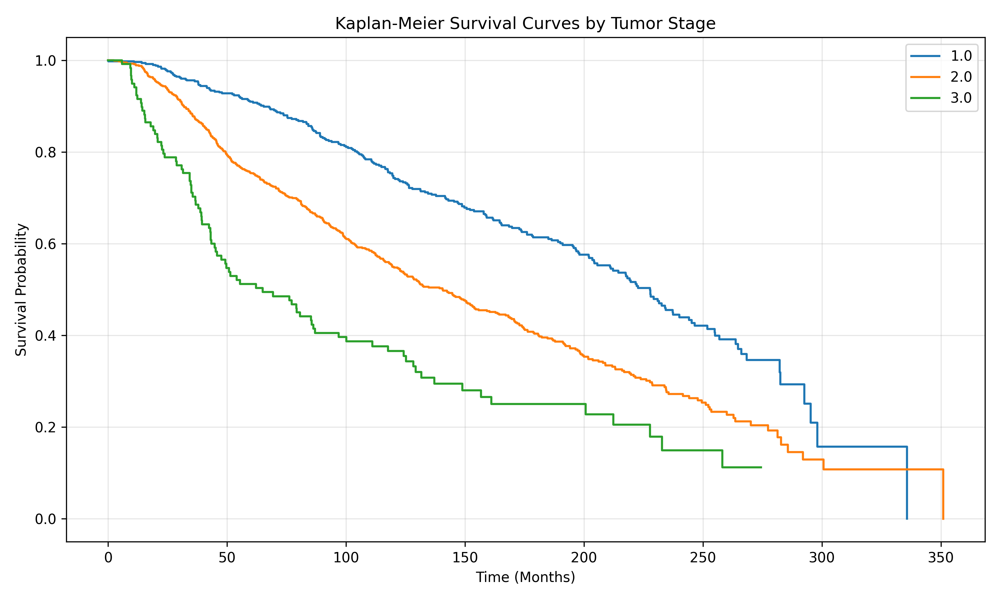
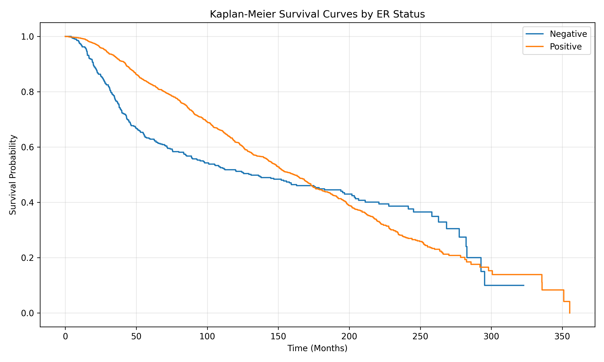
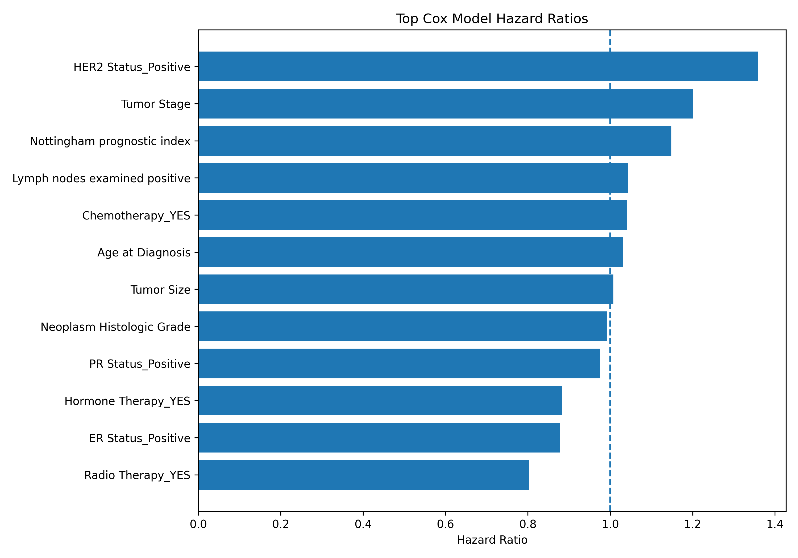
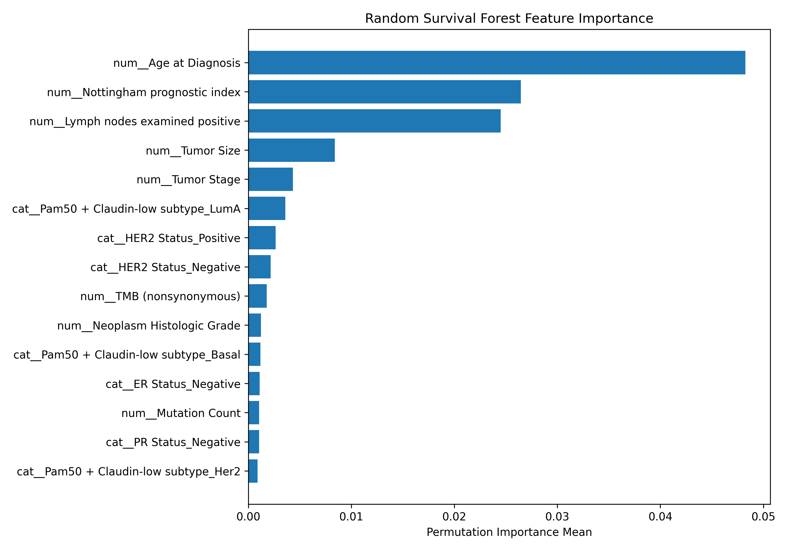

# Clinical Survival Analysis

[](https://github.com/efazHossain/clinical-survival-analysis/actions/workflows/ci.yml)

A reproducible survival analysis and machine learning project using METABRIC breast cancer clinical data to model patient survival risk, compare clinical groups, and identify key predictors of overall survival.

## Project Overview

This project applies statistical survival analysis and machine learning methods to breast cancer clinical data. It combines Kaplan-Meier curves, log-rank tests, Cox proportional hazards modeling, and Random Survival Forests.

## Clinical Question

Which clinical and tumor-related factors are associated with differences in overall survival?

## Tech Stack

| Category | Tools |
|---|---|
| Programming | Python |
| Data Analysis | pandas, NumPy |
| Visualization | Matplotlib, Seaborn |
| Survival Analysis | lifelines, scikit-survival |
| Machine Learning | scikit-learn, Random Survival Forest |
| Reporting | Jupyter Notebook, Markdown |
| Testing | pytest |
| Dashboard | Streamlit |

## Methods

- Exploratory data analysis
- Kaplan-Meier survival curves
- Log-rank hypothesis testing
- Cox proportional hazards modeling with assumption diagnostics
- Stratified Cox sensitivity modeling for PH-flagged variables
- Random Survival Forest modeling
- Concordance index, time-dependent AUC, integrated Brier score, calibration, and permutation feature importance

## Project Structure

```text
clinical-survival-analysis/
|-- data/
|   |-- raw/
|   |-- processed/
|   |-- sample/
|   `-- README.md
|-- notebooks/
|-- .github/workflows/
|-- src/
|   |-- config.py
|   |-- preprocessing.py
|   |-- survival_utils.py
|   |-- prepare_data.py
|   |-- run_kaplan_meier.py
|   |-- train_cox_model.py
|   |-- train_random_survival_forest.py
|   |-- evaluate_models.py
|   `-- pipeline.py
|-- tests/
|-- reports/
|   `-- figures/
|-- docs/
|-- app.py
|-- Makefile
|-- MODEL_CARD.md
|-- requirements.txt
|-- pyproject.toml
`-- README.md
```

## Setup

From WSL:

```bash
cd /mnt/c/Users/efazh/Projects/clinical-survival-analysis
python -m venv .venv
source .venv/bin/activate
python -m pip install --upgrade pip
python -m pip install -r requirements.txt
```

Or with `make`:

```bash
make install
```

## Data

Place the METABRIC clinical TSV at:

```text
data/raw/metabric_clinical_data.tsv
```

See `data/README.md` for data provenance and reproducibility notes. Raw and processed data are ignored by Git; generated reports include row counts, event counts, event rate, package versions, and the raw file SHA-256 hash.

## Reproducible Pipeline

Run the full analysis:

```bash
make pipeline
```

Equivalent direct command:

```bash
python src/pipeline.py
```

Individual steps:

```bash
python src/prepare_data.py
python src/run_kaplan_meier.py
python src/train_cox_model.py
python src/train_random_survival_forest.py
python src/evaluate_models.py
```

## Tests

```bash
make test
```

The tests cover the core preprocessing contract, Cox matrix preparation, survival target formatting, and event-rate summaries.

Compile all scripts:

```bash
make compile
```

## Dashboard

Run the Streamlit dashboard after generating reports:

```bash
make dashboard
```

The dashboard shows Kaplan-Meier figures, log-rank results, Cox hazard ratios, Cox diagnostics, Random Survival Forest metrics, feature importance, calibration, and data-quality summaries.

For deployment options, see `docs/dashboard_deployment.md`.

## Portfolio Case Study

For a concise project narrative covering the problem, approach, results, engineering work, interpretation, and limitations, see `docs/portfolio_case_study.md`.

## Outputs

The pipeline generates:

- Cleaned survival modeling dataset
- Data profile with row counts, event rate, and raw data hash
- Runtime package version report
- Kaplan-Meier survival plots
- Log-rank test results
- Cox model metrics, hazard ratios, missingness report, and proportional hazards diagnostics
- Stratified Cox sensitivity metrics and diagnostics for PH-flagged variables
- Random Survival Forest metrics, calibration table, feature importance report, and model artifact
- Consolidated clinical survival summary

## Visual Results

### Kaplan-Meier Survival by Tumor Stage



### Kaplan-Meier Survival by ER Status



### Cox Model Hazard Ratios



### Random Survival Forest Feature Importance



## Current Results

Previously generated reports in this repository include:

| Analysis | Result |
|---|---|
| Tumor Stage log-rank test | p = 9.35e-27 |
| ER Status log-rank test | p = 0.035 |
| Cox PH C-index | 0.680 |
| Random Survival Forest test C-index | 0.684 |
| Random Survival Forest mean time-dependent AUC | 0.718 |
| Random Survival Forest integrated Brier score | 0.177 |
| RSF feature count | 34 features |

These values should be refreshed with `python src/pipeline.py` after dependency or preprocessing changes.

## Limitations

This project is for analytical and educational purposes only. Results should not be interpreted as clinical guidance. Missing survival status is currently encoded as non-event/censored during preprocessing, which should be reviewed before clinical interpretation. Survival models may be affected by missingness, censoring patterns, cohort bias, proportional hazards violations, and dataset provenance.

## Future Improvements

- Add bootstrap confidence intervals for C-index and time-dependent AUC
- Add partial dependence or accumulated local effects for Random Survival Forest predictions
- Add external validation on an independent survival cohort
- Extend the dashboard with cohort filters and downloadable summaries
